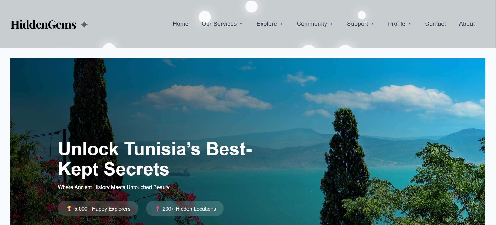

# 💎 Hidden Gems 💎

**Hidden Gems** is a web application designed to help users discover breathtaking, lesser-known destinations across Tunisia — all in one place.

> ⚠️ **Note:** The source code is private. This document provides an overview of the project and its key features.

---

## 📑 Table of Contents

1. [📘 Introduction](#-introduction)  
2. [✨ Project Description](#-project-description)  
3. [🔍 Key Features](#-key-features)  
4. [🧪 Technology Stack](#-technology-stack)  
5. [🎬 Demo](#-demo)  
6. [👥 Dev Team](#-Dev-team)  

---

## 📘 Introduction

The goal of **Hidden Gems** is to bring together a community of explorers who want to uncover Tunisia’s most captivating, lesser-known places. Instead of sifting through scattered blogs and travel forums, users can explore everything in one intuitive platform.

---

## ✨ Project Description

Whether you're a thrill-seeker, history lover, or weekend explorer, **Hidden Gems** is tailored to help you uncover Tunisia’s secret spots. It offers AI-powered recommendations, user-generated content, and local event discovery — making travel planning both efficient and inspiring.

  

---

## 🔍 Key Features

- 🔎 **AI-Powered Recommendations**  
  Get personalized destination suggestions based on your interests and browsing behavior.

- 🌟 **Community-Driven Content**  
  Explore destinations shared by other travelers and contribute your own discoveries.

- 💬 **Reviews and Ratings**  
  Rate locations and share your experiences to guide fellow adventurers.

- 📆 **Events & Trip Planning**  
  Find upcoming events and organize your travel itinerary with ease.

- 🛍️ **Local Businesses Directory**  
  Support and discover local artisans, shops, and services tied to each destination.

---

## 🧪 Technology Stack

| Frontend | Backend     | Database |
|----------|-------------|----------|
| Angular  | Spring Boot | MySQL    |

---

## 🎬 Demo

📽️ Watch the full demo here:  
[https://www.youtube.com/watch?v=blje5OiS0JY](https://www.youtube.com/watch?v=blje5OiS0JY)

---

## 👥 Dev Team

This project was developed by:

- [Mohamed Aymen Chagra](https://github.com/AymenChagra)  
- [Rihab Tlili](https://github.com/RihabDev)  
- [Meryam Bejaoui](https://github.com/meryambej)  
- [Fakher Jemli](https://github.com/FakherJemli)  
