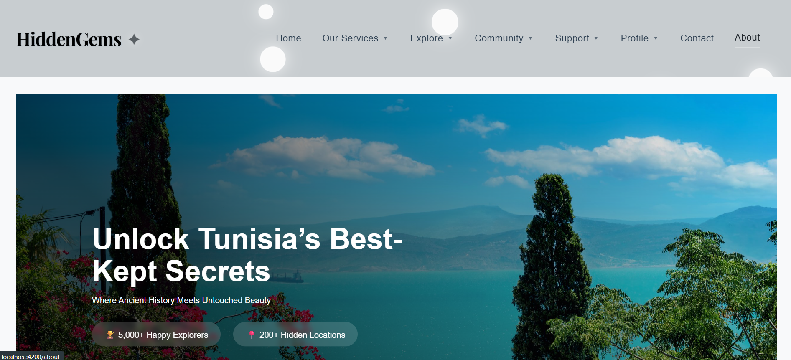
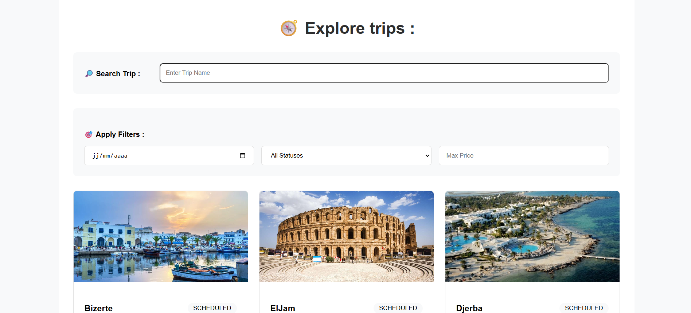
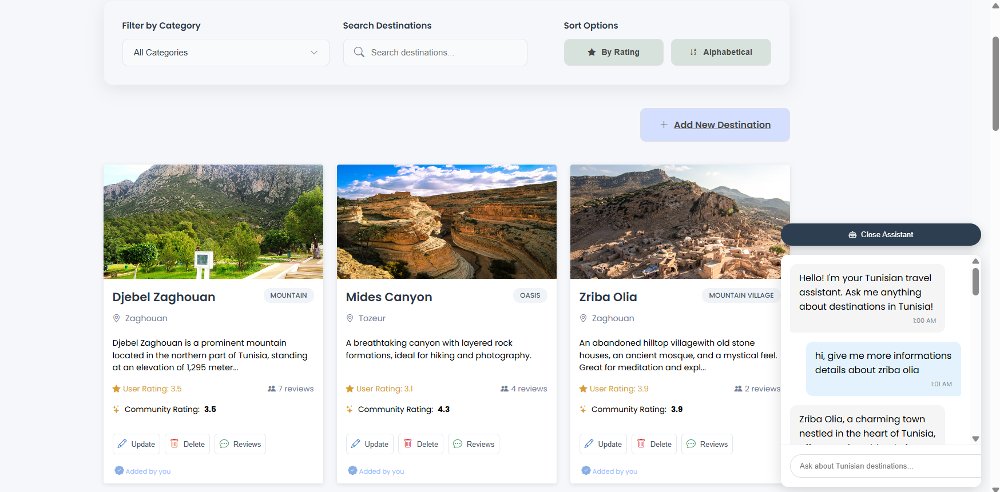
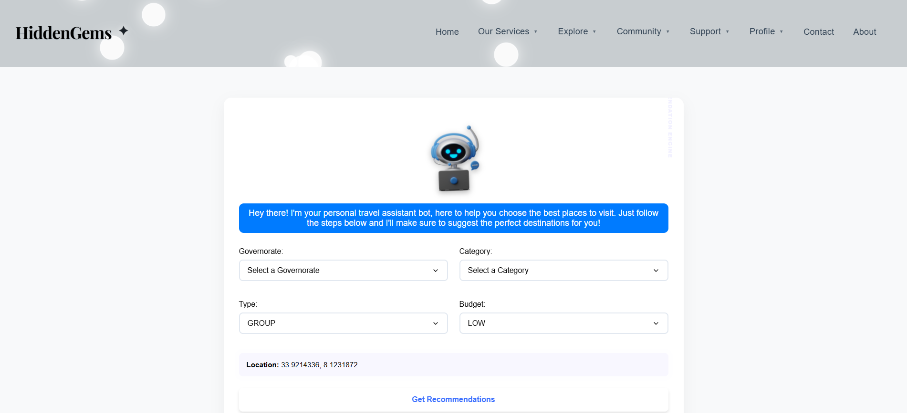

# 🌍 Hidden Gems

**Hidden Gems** is a web application designed to help users discover breathtaking, lesser-known destinations across Tunisia — all in one place.

## ✨ Description

Instead of relying on scattered online sources, Hidden Gems provides a centralized and easy-to-use platform where users can explore, review, and share hidden travel destinations in Tunisia. Whether you're an adventurer or a local explorer, this app ensures you don’t miss out on unique spots worth visiting.

## 🔍 Key Features

- 🔎 **AI-powered recommendations**: Personalized suggestions based on user preferences and interests.
- 🌟 **Community-driven content**: View and share destinations added by other users.
- 💬 **Reviews and Ratings**: Add comments and rate places to help other travelers.
- 📆 **Events & Trip Planning**: Discover upcoming events and organize your trips efficiently.
- 🛍️ **Local Businesses**: Explore local shops, services, and experiences.

## 🧪 Tech Stack

| Frontend     | Backend       | Database |
|--------------|---------------|----------|
| Angular      | Spring Boot   | MySQL    | 

## 🎬 Demo

https://www.youtube.com/watch?v=blje5OiS0JY

## 👥 Team
This project is developed by:
- [Mohamed Aymen Chagra](https://github.com/AymenChagra)
- [Rihab Tlili](https://github.com/RihabDev)
- [Meryam Bejaoui](https://github.com/meryambej)
- [Fakher Jemli](https://github.com/FakherJemli)

### 🖼️ Screenshots

  
  
  
  

